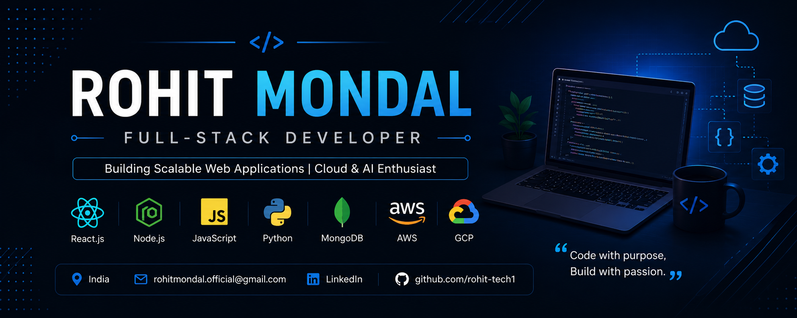

  

<h1 align="center">Hi 👋, I'm Rohit Mondal</h1>

<h3 align="center">
Full-Stack Developer | React.js | Node.js | Python | Cloud & AI Enthusiast
</h3>

---

## 🚀 About Me

💻 Passionate Full-Stack Developer  
🌱 Currently learning Kafka, AWS & System Design  
☁️ Interested in Cloud & AI Technologies  
🚀 Building scalable web applications and backend systems  

---

## 🛠️ Tech Stack

---

## 📌 Featured Projects

### 🔹 AI Threat Detection System
Real-time AI threat detection using cloud security APIs.

### 🔹 AI Powered Communication Assistant
AI assistant for customer email sentiment analysis.

### 🔹 osTicket Support System
Multi-user support ticket management system.

---

## 📊 GitHub Stats

---

## 🌐 Connect With Me

📧 rohitmondal.official@gmail.com  

💼 LinkedIn: https://www.linkedin.com/in/rohit-mondal-6910ab201/

🚀 Portfolio: Coming Soon

---

⭐️ From Rohit Mondal

